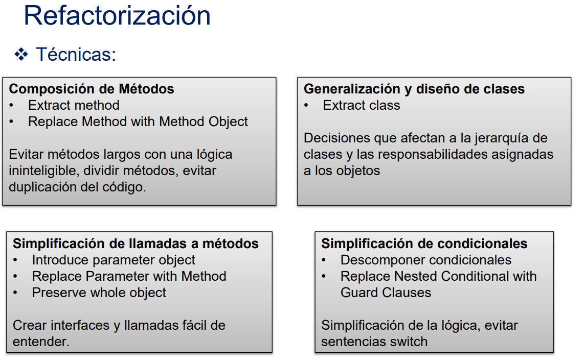

## Mantenibilidad
- Facilitar la modificacion del sw
    - ### TIPOS
            - Correctivo: corregir errores o problemas
            - Adaptativo: modificar sw para que continue siendo usabable en un entorno cambiado
            - Perfectivo: mejorar rendimiento o mantenibilidad
            - Preventivo: corregir defectos antes de que se haga efectivo

## Refactorizacion
- Modificar programa para mejorar estructura, reducir complejidad o hacerlo mas facil de entender
- Cuando se refactoriza no deberia anadir ni modificar funcionalidades
 
- ### Code smells/Bad smells
- Impacto negativo en la calidad
- Errores recurentes
- Indicador de un problema
- TIPOS
        - Duplicate code
        - Long methods
        - Switch (case) statements
        - Data clumpling (agrupacion de datos)
        - Speculative generality
- ## SonarQube: 
- open-source
- BetterCodeHub
- IDE's

## Principios sw mantenible
- 1. Codigo corto
        - No mas de 15 lineas
        - Extract method: unidades con una unica funcionalidad
                          extraer codigo a un metodo a aprte
        `method(); `
        - Replace method: variables locales al extraer el meotodo del cuerpo
        `class.method(); `

2. Codigo simple: contar numero de branchs (if, switch case, &&, ||, while, for, foreach, catch) = 5
        - Replace nested conditional w/ guard clauses
        `if() return; `
        `if() return; `
        

3. Evitar duplicaciones **BS**

4. Interfaces peques
        - Introduce parameter object: una clase para agrupar varios parametros
        - Preserve whole object: 
        `void a (B b){  }`
        - Replace parameter w/ method
        `Descuento = precio - getDescuento(); `

5. Separar concerns en modulos
        - Feature envy: getters/setters de otro metodo

6. Componentes arquitectonicos debilmente acoplados
        - Afecta a diseño arquitectonico
        - 

7. Componentes arquitectonicos balanceados
        - adecta a diseño arquitectonico
        - Equilibrar num y tamaño relativo de los componentes de alto nivel
        - Organizar el codigo

8. Base codigo pequeña

9. Automatizar pruebas

10. Codigo limpio
- No dead code
- Evitar code smells

