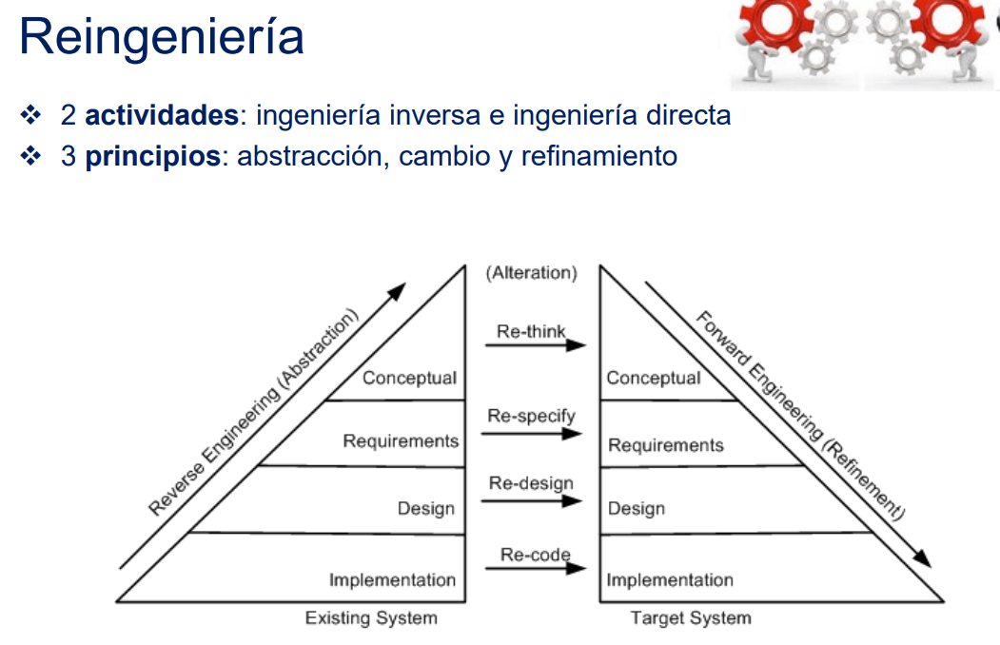
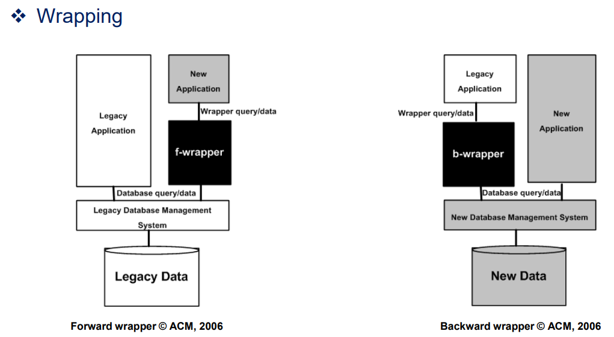
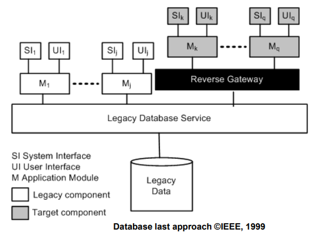
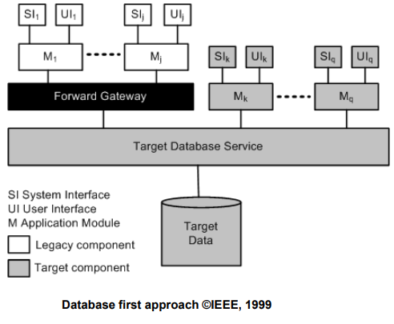
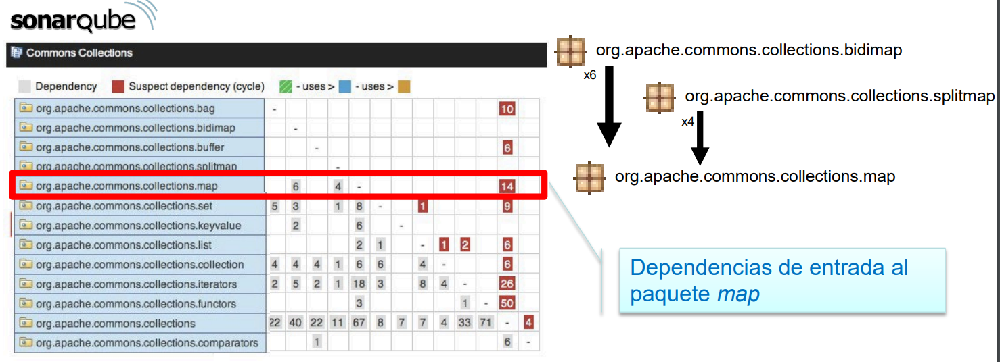

## Reingenieria
- Analisis, reestructuracion y re-documentacion de un sistema sw ya existente para recostruiro con una nueva forma y la implementacion de la nueva forma
- **Re-Codificacion**: recodificacion de caracteristicas de implementacion del codigo fuente
- **Re-Diseno**: rediseno de caracteristicas de diseno del sistema
- **Re-Especificacion**: cambio de los requisitos
- **Re-Think**: cambio de conceptos del sistema para crear un nuevo sistema. Cambio profundo

- ### Ingenieria inversa
    - Proceso de analisis de un producto existente
- ### Ingenieria directa
    - Diseñar/crear producto desde 0
## Reingenieris de datos

- ### Enfoques
        - Big Bang --> reemplazar todo el sistema de una vez
        - Enfoque parcial -->reingenieria a una parte
        - Enfoque incremental --> reingenieria gradual
        - Enfoque iterativo --> reingeniera al codigo fuente, por iteraciones
        - Enfoque evolutivo --> reingenieria gradual, por bloque funcional

## Sistemas legados/heredados
- Programa antiguo que se sigue utilizando porque sigue satisfaciendo las necesidades de los usuarios
- ### congelar
-   Datos a un datawarehouse
- ### Todo desde 0
- ### migrar
- Se conserva/mejora funcionalidad
- Se conserva/migran datos al sistema nuevo
- ### Wrapping (mantener)
        - Caja negra
        - Componente legado con una capa sw que proporciona una nueva interfaz ocultando la complejidad
        - Entrada: wrapper acepta peticiones, realiza algun procesamiento, reestrcutura peticion
        - Salida: wrapper captura la salida del objeto/entidad, reestructura la salida y la devuelve al solicitante
       `Wrappers para BD `
       `Screen scraping: wraping para interfaces textuales que se sustituyen por interfaces graficas `

## Migracion
- Incluye cambios como la reestructuracion del sistema

- ### Estrategisas
    - Cold turkey: todo D1
    - Database last: migracion de DB al final. App gradualmente
                    Reverse gateway                    

    - Data base first: migracion de DB al principio. Lo demas gradualmente
                    Forward gateway

    - Data base first && last: cambio del sistema gradual. NO el de los datos

    - Chicken little: migracion gradual del sistema legado y datos  
                    Gateway de coordinacion

## Reingenieria: Ingenieria inversa
- ### Analisis de trazabilidad
    - Trazar un elementos a lo largo de todos los resultados del desarrollo software para modificar sus cambios de forma consistente

- ### Analisis del impacto del cambio
    - Identificar los fragmentos de los distintos artefactos sw que podrian ser artefactos si se implementa una peticion de cambio
    - Analisis de dependencia: objetener las dependencias sintacticas y semanticas entre entidades de un programa
