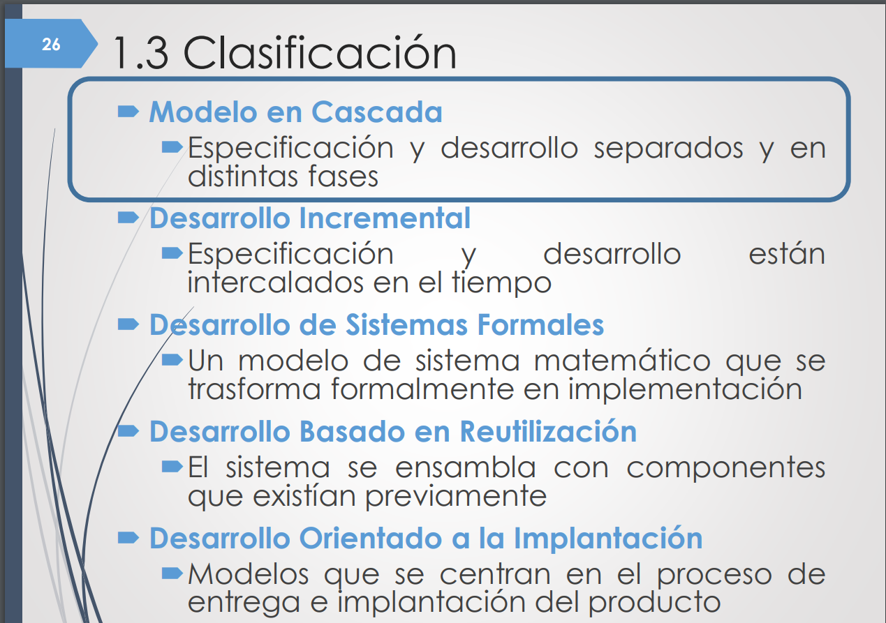

## Proceso vs Producto

## Modelo vs Ciclo de vida

## Modelos

- ### Modelos en Cascada
        - Clasico
        - Retroalimentacion
        - Clasico con prototipado
                1. Prototipo desechable
                2. Prototipo evolutivo

- ### Desarrollo Incremental
        - Modelo incemental (metodologias agiles)
        - Modelo en espiral: evolutivo y prototipado
        - RUP

- ### Desarrollo de sistemas Formales
        - Modelo general
        - MDD

- ### Desarrollo basado en Reutilizacion
        - Modelo general
        - Modelo basado en componentes
        - SPL

- ### Desarrollo orientado a la Implementacion
        - DevOps

