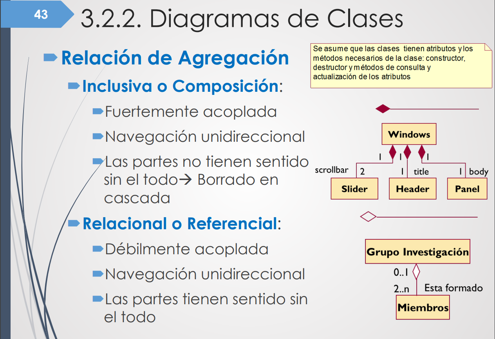
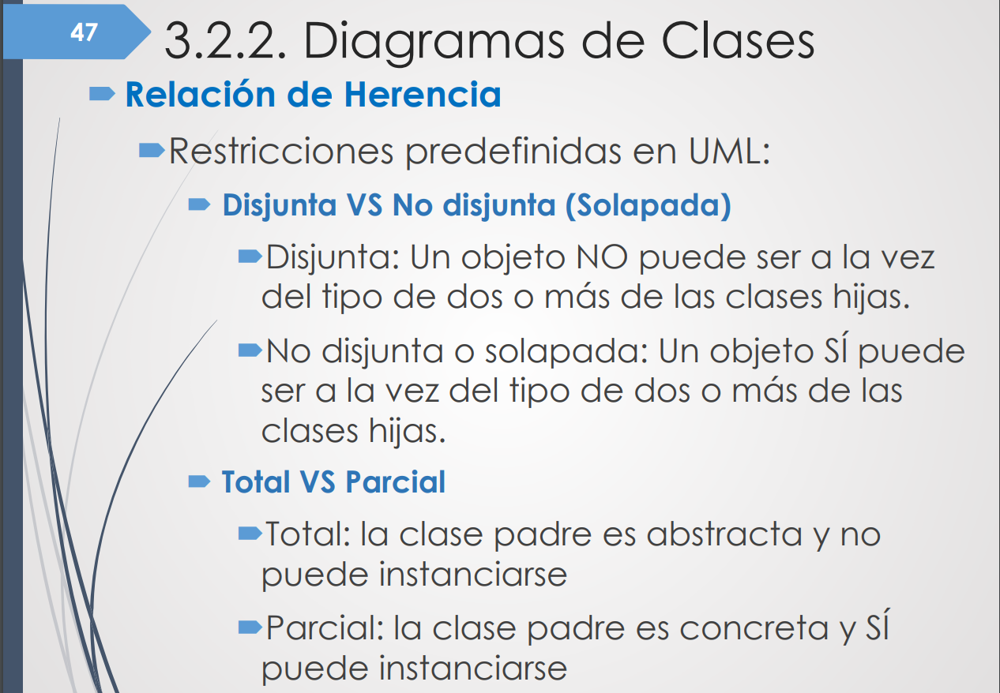
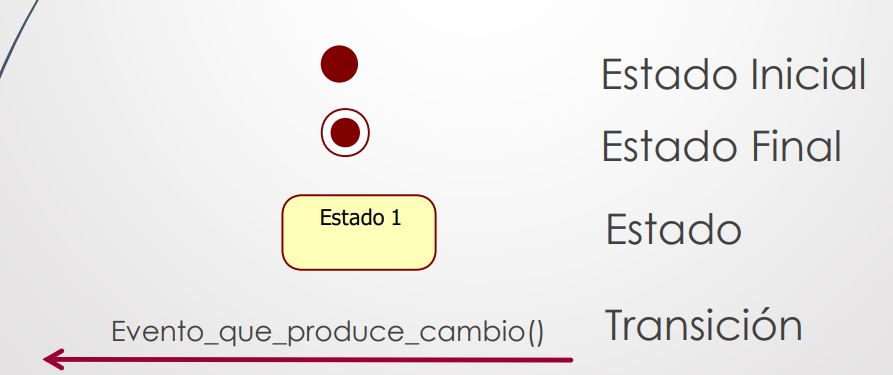
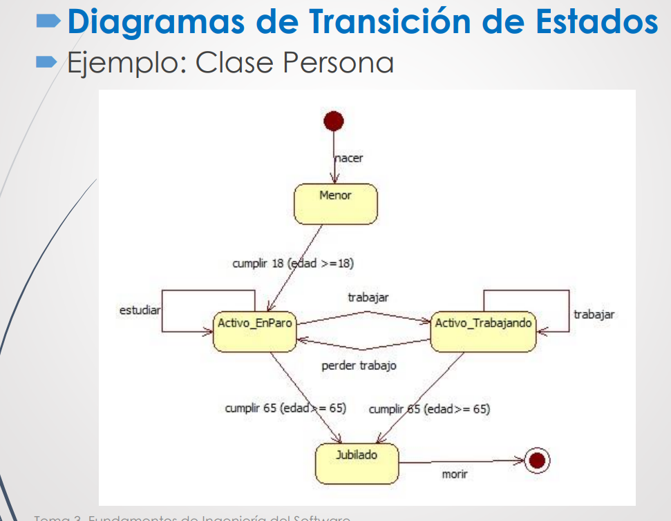
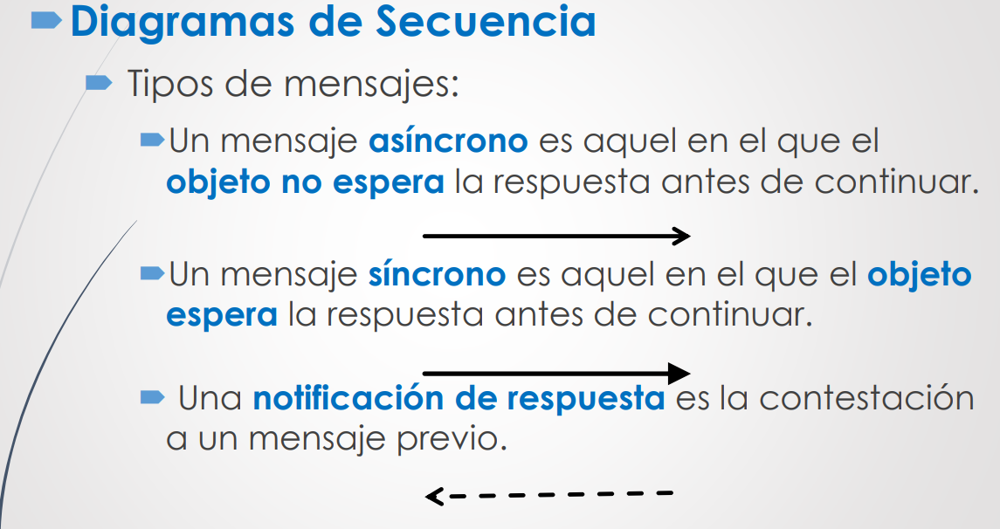
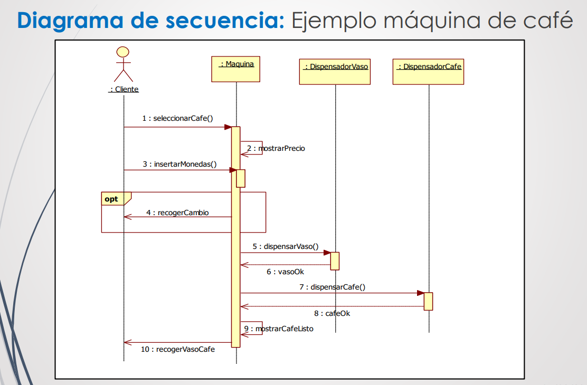
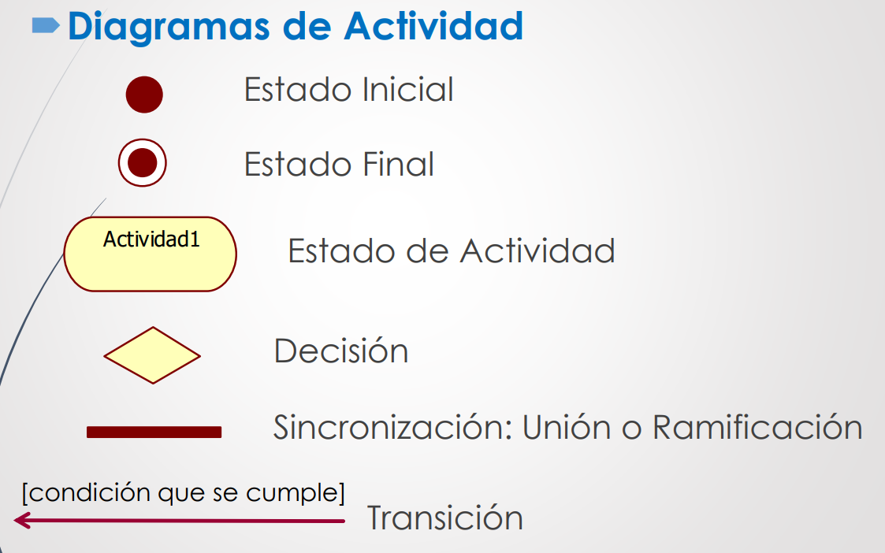
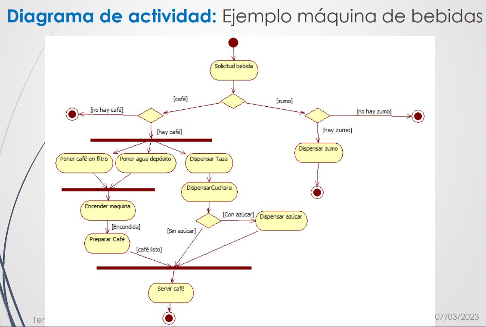

## Diagramas de clases

## Herencia
- No puede haber una clase hija vacia --> se vuelve enum

## Diagrama de transicion de estados
- Estado inicial unico
- Varios estados finales
- Al menos un estado final
- Transicion: relacion entre dos estados

## Diagrama de secuencia
- Aspectos dinamicos

## Diagrama de actividad

## Trazabilidad modelos
- Casos de uso --> Diagrama de clases 
- Casos de uso --> Diagrama de actividad 
- Casos de uso --> Diagrama de secuencia 
- Clase --> DTE

