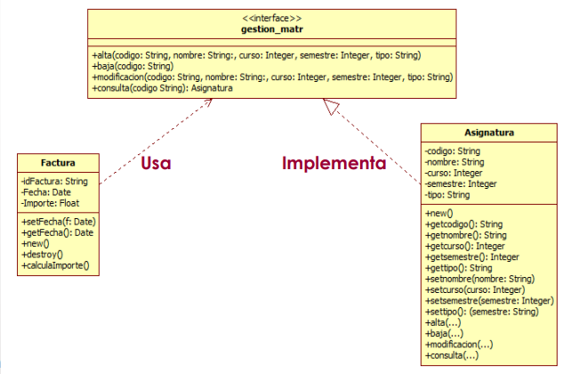
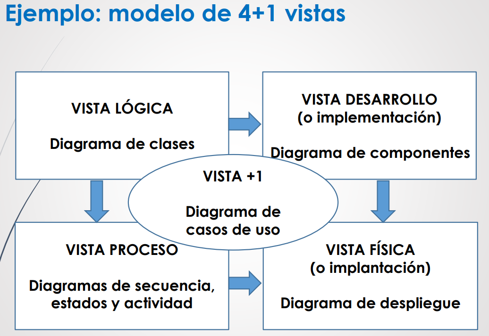

## Componentes software
- Contiene la implementacion de una o mas clases de diseño

## Interfaz
- metodos

## Abstraccion
- + abstraccion -> terminos generales
- - abstraccion -> + detalle
- Generalizacion/Especializacion (herencia)
- Agregacion/Descomposicion -<->
- Agrupacion/Individualizacion ----
- Clasificacion/instanciacion

## Modularidad
## Ocultacion de informacion
## Acoplamiento
## Cohesion

## Principios SOLID
1. Responsabilidad unica
2. Abierto/Cerrado
3. Sustitucion de Liskov
4. Segregacion de interfaces
5. Inversion de dependencias

## Patrones diseño
1. Factoria
2. Singleton
3. Adaptador
4. Proxy
5. Comando
6. Observador

## Antipatrones

## Patron arquitectonico
1. Three tier
2. n tier
3. MVC
4. Sensor controller actuador

## Estilos arquitectonicos
1. Cliente servidor
2. Pipe and filter
3. Publicador-subcriptor
4. Event based
5. Peer to peer

## Atributos de calidad

## 
