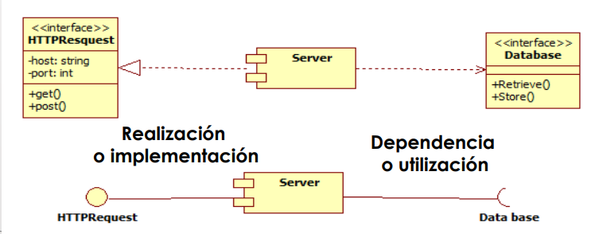

## Componentes software
- Contiene la implementacion de una o mas clases de diseño

## Interfaz
- metodos

## Abstraccion
- + abstraccion -> terminos generales
- - abstraccion -> + detalle
- Generalizacion/Especializacion
- Agregacion/Descomposicion
- Agrupacion/Individualizacion
- Clasificacion/instanciacion

## Modularidad
## Ocultacion de informacion
## Acoplamiento
## Cohesion

## Principios SOLID
1. Responsabilidad unica
2. Abierto/Cerrado
3. Sustitucion de Liskov
4. Segregacion de interfaces
5. Inversion de dependencias
