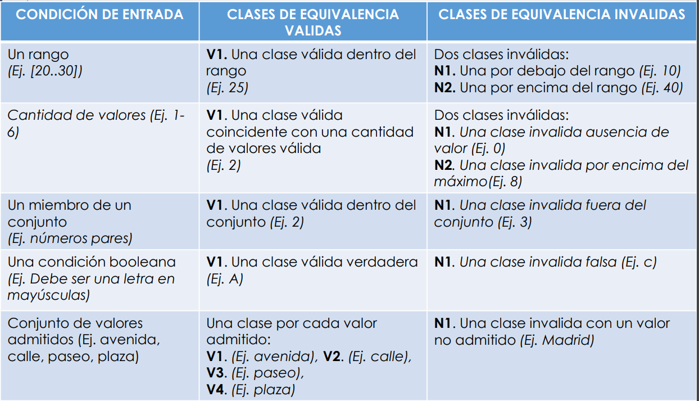
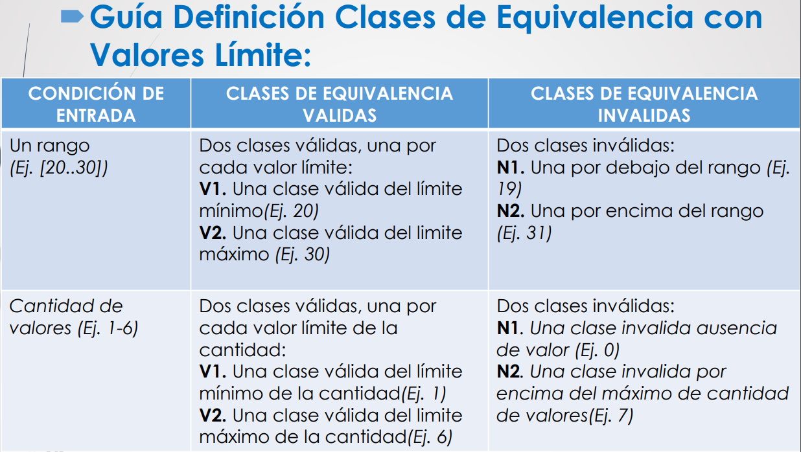

## Verificacion
- Actividades que aseguran que el sw implenta correctamente una funcion especifica

## Validacion
- Actividades que aseguran que el sw construido corresponde con los requisitos del cliente

## RTF revisiones tecnicas formales

## Caja blanca
- Rutas logicas
- Complejidad ciclomatica
1. `Regiones `
2. `Nodos predicado + 1 `
3. `Aristas - Nodos + 2 `

- Rutas independientes: rutas por las que puedes pasar
- Num rutas independientes == complejidad ciclomatica

## Caja negra
- Interfaz sw

- Casos de prueba: Probar todas las clases validas y no validas 1 vez. Solo una entrada no valida por caso de prueba

## Pruebas unitarias

## Pruebas integracion
- Integracion descendente profundidad
- Integracion descendente en anchura
- Integracion ascendente
- Pruebas de humo
- Pruebas de regresion

## Pruebas de aceptacion
- Alfa: tecnico registra errores
- Beta: usuario final

