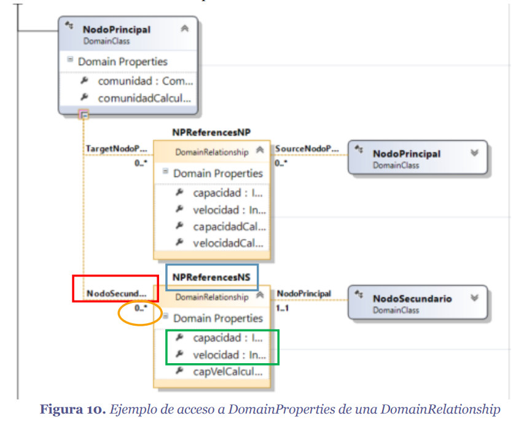
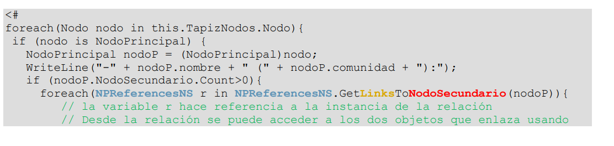

## Codigo
- `<#@ template inherits="Microsoft.VisualStudio.TextTemplating.VSHost.ModelingTextTransformation"#>`
- `<#@ output extension= "">`
- `<#       #>` Como metodo

## Herencia
- `if (~~intancia a comprobar~~ is ~~classeModelo~~)`
- Para acceder a las propiedades de la clase hija:
    `claseHija x = (claseHija)x`

## Comprobar cardinalidades
- 0...1
    `if( this.x != null)`
- 0...n
    `if( this.x.count > 0)`

## Recorrer instancias
- `foreach( A a in this.B )`

## Acceso a Domain propertis de una DomainRelationship

