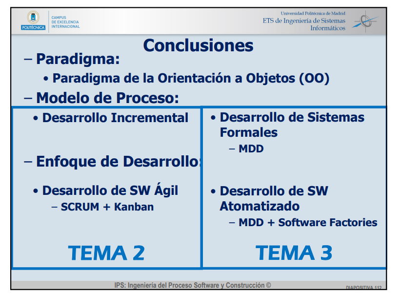

## Small
- Ingeniero entiende todo 
- Problemas con los algoritmos

## Large
- Equipo de desarrollo
- Problemas con manejo de detalles
  - Comunicación
  - Subsistemas SW

## Proceso
- Proceso específico para desarrollar un producto
- Conjunto de actividades/acciones/

### Actividades Fundamentales (DEVE)
- Desarrollo
 Especificación
 Validación
 Evolución

## Producto
- Satisfacer un objetivo funcional y atributos/cualidades

### Atributos (FIS | UCM | PE)
- Fiabilidad
 Idoneidad
 Seguridad
 Usabilidad
 Compatibilidad
 Mantenibilidad
 Portabilidad
 Eficiencia

## Principios de Construcción SW (MECA)
- Minimizar complejidad
- Anticipación al cambio
- Construcción para verificar
- Estándares en construcción

## Paradigmas de Desarrollo

## Ciclo de Vida
- Desde la concepción hasta el desecho de la idea

## Modelo de Proceso
- Organizar ciclo de vida definiendo actividades

## Actividades Principales
- Especificación
 Evolución SW
 Diseño e Implementación
 Validación
 Integración
 Mantenimiento

## Clasificación
- Modelo en cascada
- Desarrollo incremental/evolutivo
- Desarrollo de sistemas formales
- Model-Driven-Development
- Desarrollo basado en reutilización
- Desarrollo orientado a la implementación

## Desarrollo Ágil
- Adaptativo
- Orientado a código y personas
- Requisitos volátiles
- Todos pueden hacer todo
- Cliente activo en el proceso

## Desarrollo Pesado
- Predictivo
- Orientado a documentación y procesos
- Requisitos cambian ocasionalmente
- Cliente NO forma parte

## Desarrollo SW Automatizado
- Dirijido por modelos, **MDD**
- Se basa en la mejora de calidad y desarrollo sw mediante reutilizacion de arquitecturas, componentes, tecnicas y herramientas. 

## Desarrollo SW Basado en Líneas de Producto SW. SPL
- Desarrollo de una linea de producto sw para una familia de porductos
- Todos asociados a un dominio determinado
- Todos tienen:
      -Diseno arquitectonico comun
      -Conjunto de componentes reutilizables
      -Capacidades y servicios

## Desarrollo y Operaciones

## Cloud Development
- Ahorro de costes
  Coste basado en uso
  Flexibilidad
  Calidad y fiabilidad
  Seguridad
  Menos mantenimiento
- 3 Modelos de servicios
  `IaaS --> host`
  `PaaS --> build`
  `Saas --> consume`

## DevOps
- Tendencia de desarrollo para resolver el problema de la implantacion
- Automatizacion total
- Control de versiones
- CI CD
- ### DEV | OPS
      - DEV:
            Gestion de requisitos
            Analisis funcional
            Construccion
            Diseno tecnico
            Analisis de calidad
            Testing
      - OPS:
            Despliegue
            Monitoring
            Gestion de configuracion
            Gestion de incidencias

