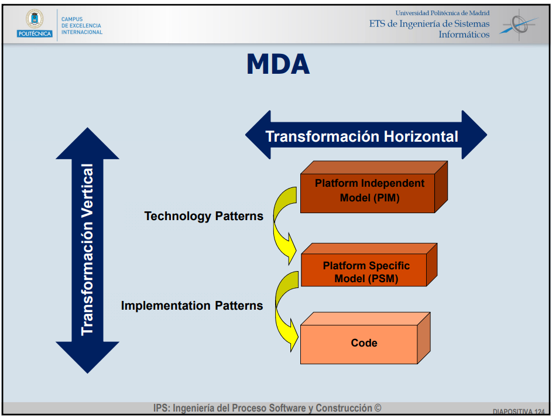
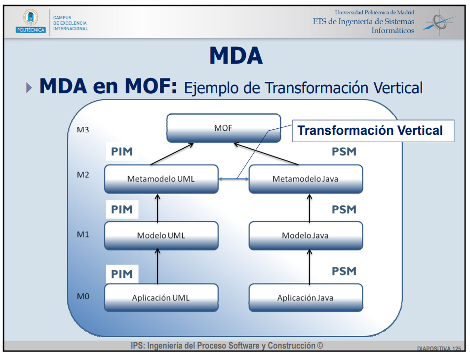

## Modelo
- Es una abstraccion de la realidad, no representa todos los aspectos de la realidad, es una imagen simplificada de un sistema
Sistema: conjunto de elementos en interaccion
- Reducir el time to market
- Aumentar calidad sw producido
- Porque utilizar modelos:
        Facilita comunicacion
        Facilita compresion
        Soucion general y reutilizable
        Mas estable
        Uso de herramientas automaticas para verificar las propiedades

## Modelo vs Diagramas
- Modelos: captura una vista de un sistema del mundo real
           abstraccion de dicho sistema
           **diagramas estaticos** (casos de uso, clases, objetos, componentes, despliegue)
- Diagrama: representacion grafica de una coleccion de   elementos de modelado
            **Diagramas dinamicos** (actividad,estados,colaboracion,secuencia)  

## MDD
- Paradigma de programacion basado en modelos
- Tecnicas de generacion automatica de codigo a apartir de modelos
- Objetivos:
        ·Productividad
        ·Portabilidad
        ·Interoperabilidad
        ·Documentacion
 

## Metamodelo (practica)
- Modelo de modelos
- Define como se han de modelar otros modelos y establece sus prioridades
## Trazabilidad. Relaciones entre modelos
- Conforme_A
        Un modelo se construye segun otro modelo
- Ser_Instancia_De
        Instancias y ibjetos hacen realidad a un modelo que describe un sistma sw

- ### MOF meta object facility
        - Estandar de object management group
        - 4 niveles de modelado
                M0: Documento XML 
                        is_instance_of
                M1: Metamodelo XML
                        conforms_to
                M2: XML schema o DTD
                        conforms_to
                M3: MOF model
        - Basado en :
                ·MDD
                ·Relaciones

## Enfoques MDD
- ### MDA meodel driven architecture
        - Representacion de sistemas en modelos abstractos
        - Resolver el problema del coste del cambio de tecnologia
        - Objetivos:
                ·Representacion de sistema en modelos abstractos
                ·Cambios tecnologicos no afecten drasticamente al sistema
                ·Facilitar mantenimiento de sistemas para incorporar nuevas tecnologias
        - 4 niveles de abstraccion ( de + a - abstraccion):
                ·**CIM** Modelo independiente de ordenador
                ·**PIM** Modelo independiente de plataforma --> Metamodelo
                ·**PSM* Modelo especifico de plataforma --> BBDD
                ·Codigo aplicacion
        - Transformacion vertical
        CIM --> PIM
        PIM --> PSM
        PSM --> codigo
        - Transformacion horizontal     
        entre diferentes vistas del sistema
        entre diferentes aspectos del sistema

-  ## Software factories
        - Mejora de la calidad y desarrollo reutilizando arquitecturas, componentes y herramientas 
        - Aplica: 
                - ## Modelado especifico de dominio **DSM**
                        - Caracteristicas:
                                ·Alta abstraccion menor esfuerzo y detalle
                                ·Generacion automatica de codigo
                                ·Para diferentes lenguajes de programacion
                                ·Permite ocultar conceptos deimplementacion
                                ·Reduce el tiempo de desarrollo
                                ·Reduce defectos en el codigo , aumenta calidad, minimiza coste
                        - Ventajas:
                                ·Reduccion de complejidad
                                ·Incremento productividad y reutilizacion
                                ·Mejora de calidad
                                ·Reduccion de defectos de codigo
                                ·Posibilidad de realizar actualziaciones de codigo semi automaticamente a partir del modelo
                                ·Beneficios altos en compañias con un alto rango
                                ·Facilita entendimiento con el cliente
                        - Incovenientes:
                                ·Gran inversion inicial para la construccion del modelo y lenguaje 
                                ·Apuesta de futuro
                                ·Muy especifico, es decir el rango de aplicacion es reducido

## DSM Lenguajes especificos de dominio **(Explicado tmb arriba)**
- Aproximacion al desarrollo sw basado en modelos y centrada en el suo de modelos especificos de dominio como principales elementos en el proceso
- Caracteristicas:
        ·Textual o grafico
        ·Facilita el entendimiento con el cliente
        ·Mayor abstraccion que los lenguajes normales
        - Generacion automatica de codigo
        ·DSL grafico no es solo una capacidad de crear diagramas

## Herramientas DSM
- ### EMF eclipse modeling framework
- ### GMF graphical modeling framework
- ### DLS tools visual studio visualization and modeling

